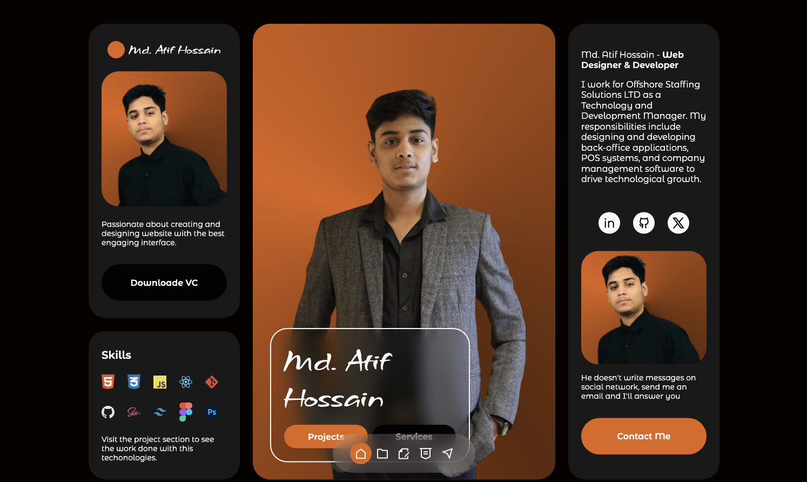

# Portfolio Website - Md. Atif Hossain



A modern, responsive portfolio website showcasing my skills, projects, and professional experience as a Web Designer & Developer.

## Features

- **Responsive Design**: Fully responsive across all device sizes
- **Interactive UI**: Smooth animations and transitions
- **Section Navigation**: Easy navigation through portfolio sections
- **Project Showcase**: Highlighted projects with technology stack
- **Contact Form**: Functional email contact form
- **Dark Mode**: Elegant dark theme with accent colors

## Technologies Used

### Frontend
- HTML5, CSS3, JavaScript
- CSS Variables for theming
- CSS Grid and Flexbox for layout
- Remix Icons for vector icons
- ScrollReveal.js for animations
- EmailJS for contact form functionality

### Deployment
- Static site hosting (Netlify/Vercel/GitHub Pages)

## Sections

1. **Home**
   - Professional profile
   - Skills showcase
   - About me
   - Social links

2. **Projects**
   - Portfolio website
   - Offshore Staffing Solutions
   - DesiPayments
   - Square Counter
   - Dashboard Management

3. **Services**
   - SaaS Product Development
   - Web Development
   - App Development
   - Web Design
   - SEO

4. **Experience**
   - Offshore Staffing Solutions LLC (CTO)
   - DesiPayments (Software Developer)
   - Square Counter (Web Developer)
   - Taka Charge (Web Developer)

5. **Contact**
   - Functional contact form
   - Direct email option

## Installation

To run this project locally:

1. Clone the repository:
   ```bash
   git clone https://github.com/MohammadAtifHossain/portfolio.git

2. Navigate to the project directory:
    ```bash
    cd portfolio

3. Open in your preferred browser:
    - Simply open index.html in your browser
    - Or use a local server like Live Server extension in VS Code

## Configuration

1. Create an account at EmailJS
2. Set up your email service (Gmail recommended)
3. Create a template with your desired email format
4. Update the following in main.js:

    ```js
    emailjs.send('YOUR_SERVICE_ID', 'YOUR_TEMPLATE_ID', '#contact-form', 'YOUR_PUBLIC_KEY')

## Customization
To personalize this portfolio:

1. Colors: Modify the CSS variables in :root
    ```css
    :root {
    --hue: 23; /* Change hue value for different color schemes */
     --first-color: hsl(var(--hue), 80%, 49%);
    /* Other color variables */
    }
2. Content: Update text content in index.html
3. Images: Replace images in assets/img/ with your own
4. Projects: Add/remove project cards in the Projects section

## Contact
Md. Atif Hossain

- LinkedIn: Mohammad Atif Hossain
- GitHub: MohammadAtifHossain
- Twitter: @MdAtif1009
- Email: atif@offshorestaffingsolutions.com


